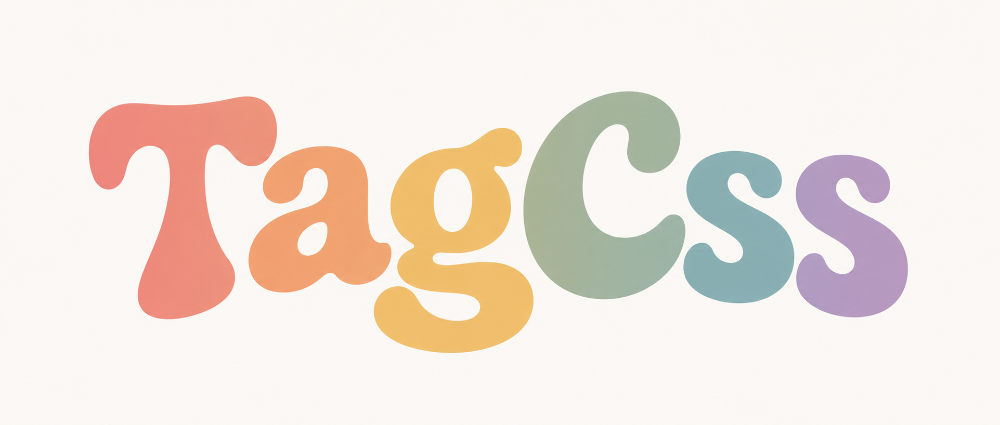

<p align="center">
  
</p>

# TagCss

**Write semantic HTML. Get beautiful UI for free.**

TagCss is a small CSS framework for people who do not want to design an interface from scratch. It styles native, semantic HTML elements so ordinary valid HTML looks polished, modern, accessible, and responsive without component classes.

## Philosophy

TagCss treats HTML as the API. You write meaningful tags such as `main`, `section`, `article`, `nav`, `form`, `label`, `button`, `table`, `details`, and `dialog`; TagCss supplies calm defaults for layout, typography, forms, tables, media, and native interactive elements.

The project intentionally does not provide utility classes such as `.btn`, `.card`, `.container`, or `.grid`. If you need a custom product design system, add your own CSS on top.

## Installation

Install from npm:

```sh
npm install @maddybo/tagcss
```

Use it in HTML:

```html
<link rel="stylesheet" href="node_modules/@maddybo/tagcss/dist/tagcss.css">
```

Use a CDN after publishing:

```html
<link rel="stylesheet" href="https://unpkg.com/@maddybo/tagcss@0.1.0/dist/tagcss.min.css">
```

For local development, you can also copy or reference `dist/tagcss.css` directly:

```html
<link rel="stylesheet" href="dist/tagcss.css">
```

## Example

```html
<main>
  <section>
    <h1>Hello TagCss</h1>
    <p>This page has no classes.</p>
    <form>
      <label>
        Email
        <input type="email" required>
      </label>
      <label>
        Password
        <input type="password" required>
      </label>
      <button>Sign in</button>
    </form>
  </section>
</main>
```

## Themes

TagCss supports the browser color scheme and explicit theme selection:

```html
<html data-theme="light">
<html data-theme="dark">
```

The root stylesheet declares:

```css
:root {
  color-scheme: light dark;
}
```

## Accents

Change the accent color with an HTML attribute:

```html
<html data-accent="violet">
<html data-accent="blue">
<html data-accent="green">
<html data-accent="rose">
<html data-accent="amber">
```

These are attributes, not utility classes.

## Custom Tokens

TagCss is designed to be customized through CSS custom properties. Add your overrides after the TagCss stylesheet:

```html
<link rel="stylesheet" href="dist/tagcss.css">
<style>
  :root {
    --tc-accent: oklch(58% 0.18 150);
    --tc-accent-strong: oklch(48% 0.18 150);
    --tc-radius: 0.5rem;
    --tc-content-width: 78rem;
    --tc-text-width: 72ch;
  }
</style>
```

Useful tokens include colors (`--tc-bg`, `--tc-surface`, `--tc-text`, `--tc-border`, `--tc-accent`, `--tc-danger`, `--tc-success`, `--tc-warning`), spacing (`--tc-space-1` to `--tc-space-8`), typography (`--tc-font-sans`, `--tc-font-mono`, `--tc-size-0` to `--tc-size-5`), radii, shadows, transitions, and content widths.

## Styled HTML Elements

TagCss includes defaults for:

- Document layout: `html`, `body`, `body > header`, `main`, `section`, `article`, `aside`, `footer`
- Navigation: `nav`, `nav a`, `nav ul`, `aria-current`
- Typography: `h1` to `h6`, `p`, `a`, `strong`, `em`, `small`, `mark`, `blockquote`, `hr`, `code`, `pre`, `kbd`, `samp`, `abbr`, `time`
- Lists: `ul`, `ol`, `li`, `dl`, `dt`, `dd`
- Media: `img`, `picture`, `figure`, `figcaption`, `video`, `audio`, `canvas`, `svg`, `iframe`
- Forms: `form`, `fieldset`, `legend`, `label`, `input`, `textarea`, `select`, `option`, `button`, `meter`, `progress`, `output`
- Tables: `table`, `caption`, `thead`, `tbody`, `tfoot`, `tr`, `th`, `td`
- Native interaction: `details`, `summary`, `dialog`, `menu`, `[popover]`
- States: `:hover`, `:focus-visible`, `:active`, `:disabled`, `[aria-disabled="true"]`, `[aria-current="page"]`, `[aria-busy="true"]`, `[hidden]`, `:target`
- Accessibility attributes: `[aria-invalid="true"]`, `[aria-live]`, `[role="alert"]`, `[role="status"]`, `readonly`, `required`

## Semantic Recipes

The demo includes `docs/recipes.html` with copyable examples for login forms, pricing tables, documentation articles, settings pages, dashboard summaries, and newsletter forms. These recipes use tags and attributes only, not classes.

## When to use TagCss

Use TagCss for documentation, prototypes, internal tools, small SaaS pages, content sites, demos, admin pages, and forms where semantic HTML should look good immediately.

## When not to use TagCss

Do not use TagCss as the only styling layer when you need a heavily branded marketing site, a complex app-specific component system, fine-grained utility composition, or pixel-perfect design parity with a custom design file.

## Accessibility

TagCss keeps native behavior intact. It provides strong `:focus-visible` styles, respects `prefers-reduced-motion`, supports `color-scheme`, styles disabled and ARIA states, preserves outlines with visible replacements, and includes a skip-link pattern using `body > a[href="#main"]:first-child`.

You are still responsible for semantic HTML, correct labels, meaningful link text, valid heading structure, useful alt text, and appropriate ARIA usage.

## Build

This repository is intentionally dependency-free. The source file is `src/tagcss.css`; distribution files in `dist/` are generated by `scripts/build.mjs`.

```sh
npm run build
npm run minify
```

Generated files:

- `dist/tagcss.css`: default full build
- `dist/tagcss.min.css`: minified full build
- `dist/tagcss.layered.css`: explicit layered build, currently equivalent to the default file
- `dist/tagcss.resetless.css`: build without TagCss reset layer
- `dist/tagcss.resetless.min.css`: minified resetless build

## Visual Regression

TagCss includes an optional Playwright visual test setup:

```sh
npm install
npm run test:visual
```

The tests render the demo page in desktop and mobile Chromium viewports and compare screenshots. They are optional for consumers of the CSS package.

## License

MIT
