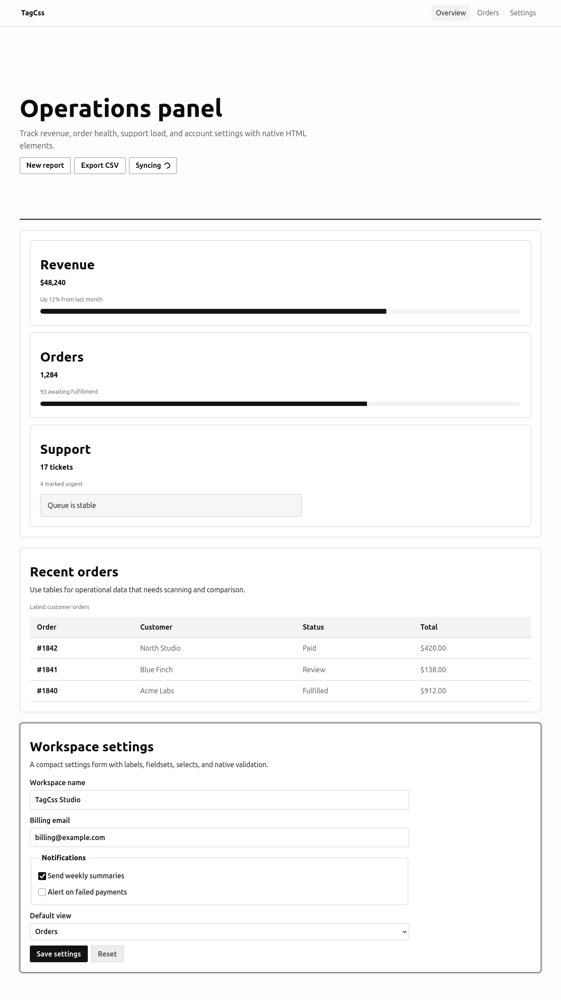

<p align="center">
  
</p>

# TagCss

**Write semantic HTML. Get clean UI for free.**

TagCss is a small classless CSS framework for people who do not want to design an interface from scratch. It styles native, semantic HTML elements so ordinary valid HTML looks clean, modern, accessible, and responsive without component classes.



## Philosophy

TagCss treats HTML as the API. You write meaningful tags such as `main`, `section`, `article`, `nav`, `form`, `label`, `button`, `table`, `details`, and `dialog`; TagCss supplies calm defaults for layout, typography, forms, tables, media, and native interactive elements.

The project intentionally does not provide utility classes such as `.btn`, `.card`, `.container`, or `.grid`. If you need a custom product design system, add your own CSS on top.

The default visual direction is minimal and editorial: monochrome surfaces, crisp borders, compact spacing, restrained rounded corners, and a Notion-like `ink` accent. Color accents are available, but they are intentionally secondary.

## Installation

Install from npm:

```sh
npm install @maddybo/tagcss
```

Use it in HTML:

```html
<link rel="stylesheet" href="node_modules/@maddybo/tagcss/dist/tagcss.css">
```

Use a CDN after publishing:

```html
<link rel="stylesheet" href="https://unpkg.com/@maddybo/tagcss@0.1.1/dist/tagcss.min.css">
```

For local development, you can also copy or reference `dist/tagcss.css` directly:

```html
<link rel="stylesheet" href="dist/tagcss.css">
```

## Example

```html
<!doctype html>
<html data-theme="light" data-accent="ink">
  <head>
    <link rel="stylesheet" href="dist/tagcss.css">
  </head>
  <body>
    <main id="main">
      <header>
        <h1>Hello TagCss</h1>
        <p>This page has no classes.</p>
      </header>
      <section>
        <form>
          <label>
            Email
            <input type="email" required>
          </label>
          <label>
            Password
            <input type="password" required>
          </label>
          <button>Sign in</button>
        </form>
      </section>
    </main>
  </body>
</html>
```

## Themes

TagCss supports the browser color scheme and explicit theme selection:

```html
<html data-theme="light">
<html data-theme="dark">
```

The root stylesheet declares:

```css
:root {
  color-scheme: light dark;
}
```

## Accents

The default accent is `ink`, a monochrome accent designed for minimal interfaces:

```html
<html data-accent="ink">
```

Optional color accents are available when a page needs a little more identity:

```html
<html data-accent="violet">
<html data-accent="blue">
<html data-accent="green">
<html data-accent="rose">
<html data-accent="amber">
```

Accents are attributes, not utility classes. They affect links, primary buttons, progress bars, focus treatment, and selected navigation states.

## Custom Tokens

TagCss is designed to be customized through CSS custom properties. Add your overrides after the TagCss stylesheet:

```html
<link rel="stylesheet" href="dist/tagcss.css">
<style>
  :root {
    --tc-accent-chroma: 0.08;
    --tc-accent-hue: 235;
    --tc-radius: 0.35rem;
    --tc-content-width: 78rem;
    --tc-text-width: 72ch;
  }
</style>
```

Useful tokens include colors (`--tc-bg`, `--tc-surface`, `--tc-text`, `--tc-text-muted`, `--tc-border`, `--tc-accent`, `--tc-danger`, `--tc-success`, `--tc-warning`), accent controls (`--tc-accent-chroma`, `--tc-accent-hue`), spacing (`--tc-space-1` to `--tc-space-8`), typography (`--tc-font-sans`, `--tc-font-mono`, `--tc-size-0` to `--tc-size-5`), radii, shadows, transitions, content widths, and nested surface tokens.

### Nested radius rule

TagCss uses a concentric corner rule for nested surfaces. When an element has its own padding and rounded corners, direct child surfaces use an inner radius based on:

```css
--tc-inner-radius: max(0px, calc(var(--tc-radius) - var(--tc-surface-padding)));
```

This keeps nested corners visually aligned instead of stacking unrelated rounded rectangles. Larger parent padding produces a smaller child radius; when the padding is larger than the parent radius, the child radius becomes `0`.

You can override this per component:

```css
article {
  --tc-surface-padding: 1rem;
  --tc-inner-radius: 0.25rem;
}
```

## Styled HTML Elements

TagCss includes defaults for:

- Document layout: `html`, `body`, `body > header`, `main`, `section`, `article`, `aside`, `footer`
- Navigation: `nav`, `nav a`, `nav ul`, `aria-current`
- Typography: `h1` to `h6`, `p`, `a`, `strong`, `em`, `small`, `mark`, `blockquote`, `hr`, `code`, `pre`, `kbd`, `samp`, `abbr`, `time`
- Lists: `ul`, `ol`, `li`, `dl`, `dt`, `dd`
- Media: `img`, `picture`, `figure`, `figcaption`, `video`, `audio`, `canvas`, `svg`, `iframe`
- Forms: `form`, `fieldset`, `legend`, `label`, `input`, `textarea`, `select`, `option`, `button`, `meter`, `progress`, `output`
- Tables: `table`, `caption`, `thead`, `tbody`, `tfoot`, `tr`, `th`, `td`
- Native interaction: `details`, `summary`, `dialog`, `menu`, `[popover]`
- States: `:hover`, `:focus-visible`, `:active`, `:disabled`, `[aria-disabled="true"]`, `[aria-current="page"]`, `[aria-busy="true"]`, `[hidden]`, `:target`
- Accessibility attributes: `[aria-invalid="true"]`, `[aria-live]`, `[role="alert"]`, `[role="status"]`, `readonly`, `required`

## Semantic Recipes

The demo includes `docs/recipes.html` with copyable examples for login forms, pricing tables, documentation articles, settings pages, dashboard summaries, and newsletter forms. These recipes use tags and attributes only, not classes.

## Layout Examples

Ready-made light-mode page layouts are available in `examples/`:

- `examples/panel.html`: admin and operations panel
- `examples/blog.html`: article and blog archive
- `examples/product.html`: product page with plans and contact form

## When to use TagCss

Use TagCss for documentation, prototypes, internal tools, small SaaS pages, content sites, demos, admin pages, and forms where semantic HTML should look good immediately.

## When not to use TagCss

Do not use TagCss as the only styling layer when you need a heavily branded marketing site, a complex app-specific component system, fine-grained utility composition, or pixel-perfect design parity with a custom design file.

## Accessibility

TagCss keeps native behavior intact. It provides strong `:focus-visible` styles, respects `prefers-reduced-motion`, supports `color-scheme`, styles disabled and ARIA states, preserves outlines with visible replacements, and includes a skip-link pattern using `body > a[href="#main"]:first-child`.

You are still responsible for semantic HTML, correct labels, meaningful link text, valid heading structure, useful alt text, and appropriate ARIA usage.

## Build

This repository is intentionally dependency-free. The source file is `src/tagcss.css`; distribution files in `dist/` are generated by `scripts/build.mjs`.

```sh
npm run build
npm run minify
```

Generated files:

- `dist/tagcss.css`: default full build
- `dist/tagcss.min.css`: minified full build
- `dist/tagcss.layered.css`: explicit layered build, currently equivalent to the default file
- `dist/tagcss.resetless.css`: build without TagCss reset layer
- `dist/tagcss.resetless.min.css`: minified resetless build

Before publishing a new npm release, bump `version` in `package.json`; npm does not allow republishing an existing version.

## Visual Regression

TagCss includes an optional Playwright visual test setup:

```sh
npm install
npm run test:visual
```

The tests render the demo page in desktop and mobile Chromium viewports and compare screenshots. They are optional for consumers of the CSS package.

## License

MIT
